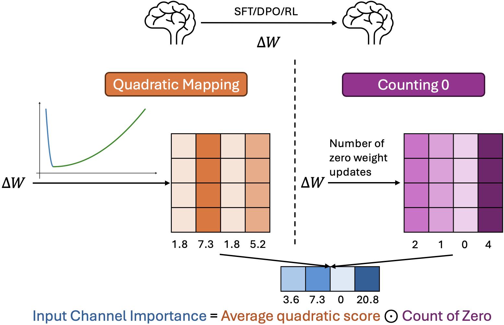

# QuantLRM

Code for quantization paper [QuantLRM: Quantization of Large Reasoning Models via Fine-Tuning Signals](https://arxiv.org/abs/2602.02581). State-of-the-art sub-4-bit weight-only quantization.

Navigation:
[Overview](#overview), 
[Install](#install),
[Calibration Data](#calibration-data),
[Usage](#usage),
[QuantLRM on Hugging Face](#quantlrm-on-hugging-face),
[Acknowledgement](#acknowledgement),
[Citation](#citation)


## Overview
We introduce **QuantLRM**, weight quantization of large reasoning models (LRMs) via fine-tuning signals. Inspired by the spirit of classical magnitude pruning, QuantLRM protects weights that have the smallest and largest weight updates during fine-tuning, a phenomenon we term “protecting both ends”. QuantLRM fits simple restricted quadratic functions on weight updates to protect both ends. By multiplying the average quadratic values with the count of zero weight updates of channels, QuantLRM computes channel importance that is more effective than using activation or second-order information. QuantLRM injects computed channel importance scores into the quantization loss function as scaling factors and searches for the optimal parameter to minimize the loss. QuantLRM delivers significant and consistent improvements for LRMs quantization on mainstream post-trained LRMs (SFT, DPO, RL). **For example, we get an average improvement of 6.55% on 3-bit Olmo-3-7B-Think**.




## Install
Clone our repository.

```
    git clone https://github.com/psunlpgroup/QuantLRM
    cd QuantLRM
```


Install packages necessary for computing channel importance and running quantization pipeline. For Olmo3, update your `transformer` library to the newest version (>=5.0.0) to avoid errors such as dimension mismatch. For Qwen3, `transformer` version needs to be at least 4.51.0.

```
    conda create -n QuantLRM python=3.10 -y
    conda activate QuantLRM
    pip install --upgrade pip  # enable PEP 660 support
    cd quant_pipeline
    pip install -e .
    cd awq/kernels
    python setup.py install
```


We recommend to use `vLLM` for inference on 3-bit pseudo-quantized LRMs, as there does not exist a kernel that supports 3-bit quantization. For 4-bit, the above installation will get you ready for inference using AWQ kernel. When using `vLLM`, please isolate your inference environment using a separate virtual environment to avoid the disruption of dependency used for quantization. We show an example below to setup inference environment. 

```
    python -m venv venv
    source venv/bin/activate
    pip install -r requirements.txt   # you may directly install vllm instead
```

## Calibration Data
You do not need to specify anything for the default calibration set. As discussed in Section 4.1, we provide reasoning data as the second choice of calibration set in `reasoning_data.txt`, but we do not recommend using the reasoning data for calibration due to performance reasons. In case reasoning calibration set is desired, please specify `--calib_data reasoning` in the search command below.


## Usage
First of all, you need to compute input channel importance scores. Run commands below to get weight updates and its quadratic mapping. Outputs will be saved in `weight_difference` and `quadratic`, repectively. Run the files with `_olmo3` for olmo3-based LRMs, since we only compute channel importance for o_proj and down_proj to allow precision mapping. Remember to adjust the number of layers and target modules (e.g., `q_proj`) that fit your target LRMs.

```
    python compare_weight_matrix.py
    python quadratic_mapping.py   # supports processing weight updates on GPUs
```

Then, run our quantization pipeline to search for the optimal scales (Figure 2 of QuantLRM). The two core files to focus on are `quant_pipeline/awq/quantize/pre_quant.py` and `auto_scale.py`. They correspond to R1-Qwen3-8B now. As we have conducted experiments on various LRMs, we place the code of other models in `quant_pipeline/other models`. You may notice some model adaptations on certain LRMs as discussed in Section 4.4. Please replace the current `pre_quant.py` and `auto_scale.py` with the model you target.

```bash
python -m awq.entry --model_path /PATH/TO/LRM \
    --w_bit 3 --q_group_size 128 --run_awq --dump_awq QuantLRM_cache/R1-Qwen3-8B-w3-g128.pt
```

You can save pseudo-quantizated model after the search and perform inference. Our sample inferecne code contains the hyperparameters and prompts we used.
```bash
python -m awq.entry --model_path /PATH/TO/LRM \
    --w_bit 3 --q_group_size 128 \
    --load_awq QuantLRM_cache/R1-Qwen3-8B-w3-g128.pt \
    --q_backend fake --dump_fake models/R1-Qwen3-8B-w3-g128

CUDA_VISIBLE_DEVICES=0 python inference_vllm.py
```

Or save the real quantizated model for inference using AWQ kernel (4-bit quantization in this case).
```bash
python -m awq.entry --model_path /PATH/TO/LRM \
    --w_bit 4 --q_group_size 128 \
    --load_awq QuantLRM_cache/R1-Qwen3-8B-w4-g128.pt \
    --q_backend real --dump_quant QuantLRM_cache/R1-Qwen3-8B-w4-g128-real.pt
```

## QuantLRM on Hugging Face

For ease of use and demonstration purposes, we have uploaded all 3-bit QuantLRM models listed in Table 2. They can be found on [Hugging Face](https://huggingface.co/models?other=arxiv:2602.02581).


## Acknowledgement
* Our quantization pipeline is developed based on AWQ: https://github.com/mit-han-lab/llm-awq/tree/main.
* The idea of only searching for the scales of o_proj and down_proj on Olmo3 is based on LLM Compressor: https://github.com/vllm-project/llm-compressor.

## Citation
```bibtex
@misc{zhang2026quantlrmquantizationlargereasoning,
      title={QuantLRM: Quantization of Large Reasoning Models via Fine-Tuning Signals}, 
      author={Nan Zhang and Eugene Kwek and Yusen Zhang and Muyu Pan and Suhang Wang and Prasenjit Mitra and Rui Zhang},
      year={2026},
      eprint={2602.02581},
      archivePrefix={arXiv},
      primaryClass={cs.LG},
      url={https://arxiv.org/abs/2602.02581}, 
}
```